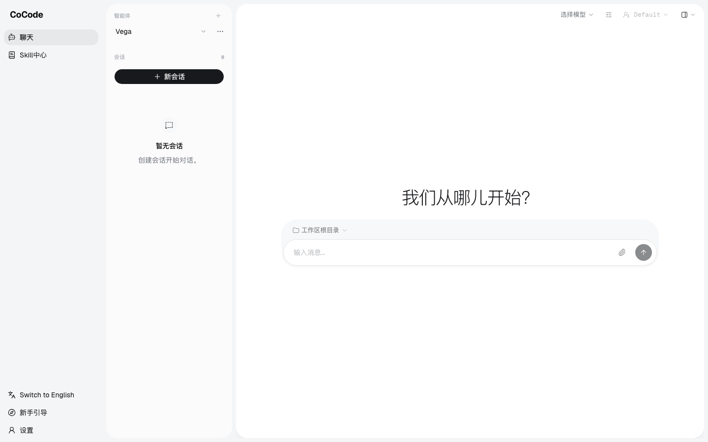
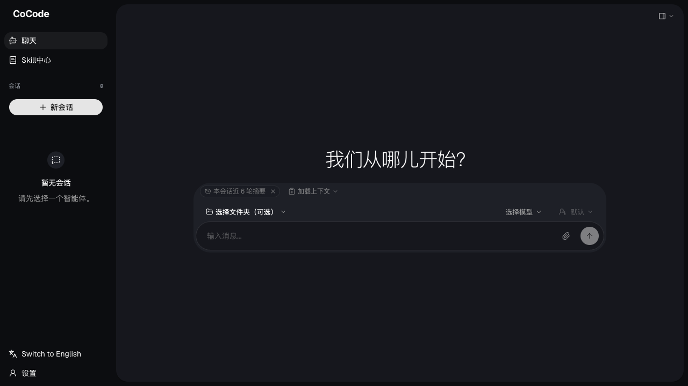
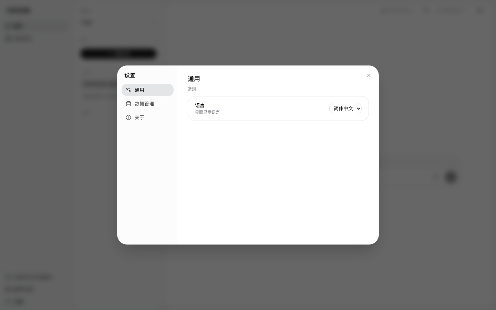
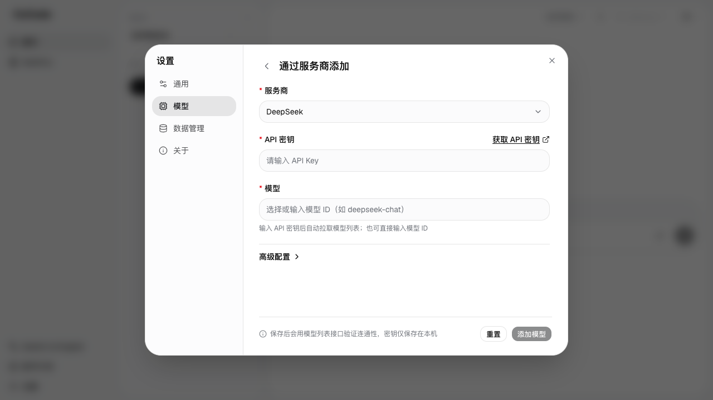

<p align="right"><a href="README.en.md">English</a> | <b>简体中文</b></p>

<div align="center">


# CoCode — 全面 Agent 工具

**自接入模型 · 低 token 高效率 · Electron + CLI 双版本**

</div>

一款自托管友好的编程 Agent 工具。前端采用 [agentscope](https://github.com/agentscope-ai/agentscope) 风格 UI（侧栏会话列表 + 工具调用卡片 + 流式聊天 + 权限确认卡），核心引擎**零依赖**、协议自洽、可接入任何 OpenAI 兼容模型。

## ✨ 特点

- **自接入模型**：任何 OpenAI 兼容接口（OpenAI / DeepSeek / 智谱 / Moonshot / Ollama / vLLM…）；模型不支持 `tool_calls` 时自动降级为文本 ReAct，不会整个失效
- **低 token 多干活**：repo map + 本地代码索引（符号 / 语义倒排）+ 上下文自动治理（驱逐旧工具输出 + 历史摘要压缩）+ 工具输出截断 + prompt cache + 变更感知上下文
- **零依赖核心**：core 包不依赖任何 npm 模块，纯 Node.js（≥18）+ fetch
- **18 个内置工具**：`Bash` `Read` `Write` `Edit` `Glob` `Grep` `WebFetch` `WebSearch` `Git` `RepoMap` `Checkpoint` `Lsp` `Search` `Browser`（内置浏览器，支持 `screenshot` 截图给模型看）+ `TaskCreate` `TaskUpdate` `TaskGet` `TaskList`（结构化任务，实时显示在「计划」面板）+ `Subagent`（派子代理并行调研，权限只降不升）
- **MCP 服务器接入**：`config.json` 的 `mcpServers`（stdio 传输，与 Claude Desktop 同形），工具以 `mcp__服务器__工具` 进入会话；设置 → 高级 里可视化增删与探测
- **内置浏览器**：右侧「浏览器」面板里是应用自带的真实浏览器（Electron `<webview>`）—— 你可以自己输网址、登录、查文档；Agent 也能用 `Browser` 工具在同一个视图里打开页面、读正文、点击、输入
- **人类在环（HITL）**：5 档权限模式 + 询问确认卡 + 允许清单（"以后都这样"一键固化）
- **生命周期钩子**：`UserPromptSubmit` / `PreToolUse` / `PostToolUse` / `Stop` 四个挂点，可用任意命令做决策与注入
- **可回滚**：每轮写入/执行前自动建检查点，CLI `/restore`、桌面端「检查点」面板一键回滚
- **双版本**：
  - **CLI** — 终端 REPL，ANSI 流式输出，交互式权限确认
  - **Electron 桌面端** — agentscope 风格 Web UI，本地服务 + Electron 壳

## 📸 界面预览

| | |
|---|---|
|  |  |
| *聊天主页 · 侧栏会话列表* | *深色主题* |
|  |  |
| *设置窗口 · 连接信息 / 高级选项* | *添加模型 · OpenAI 兼容表单* |

## 📦 架构（monorepo）

```
packages/
├── core/              # 引擎 + ASAPI 协议适配（零依赖）
│   ├── src/
│   │   ├── config.js           模型接入与低 token 配置（COCODE_HOME 可重定向数据根）
│   │   ├── model.js            OpenAI 兼容流式 Chat Completions + SSE 解析 + 能力探测
│   │   ├── security.js         路径沙箱 / 子进程环境净化 / 密钥脱敏
│   │   ├── prompt.js           项目指令注入（COCODE.md / AGENTS.md）+ system prompt 组装
│   │   ├── react.js            文本 ReAct 动作解析（模型不支持 function calling 时用）
│   │   ├── discover.js         本地模型自动发现（Ollama / LM Studio / vLLM …）
│   │   ├── commands.js         自定义斜杠命令（~/.cocode/commands/*.md）
│   │   ├── tools/
│   │   │   ├── builtin.js      Bash / Read / Write / Edit / Glob / Grep（+ 图片读取）
│   │   │   ├── shell.js        持久 shell 会话（cd / export 跨调用保留）
│   │   │   ├── web.js          WebFetch / WebSearch
│   │   │   ├── git.js          Git 工具 + 仓库状态探测
│   │   │   ├── repomap.js      仓库符号骨架（主动省 token）
│   │   │   └── checkpoint.js   内容寻址检查点与回滚
│   │   ├── context.js          token 估算 + 驱逐 + 摘要压缩
│   │   ├── agent.js            Agent 循环（权限闸口 / 并行工具 / HITL / 降级）
│   │   ├── session.js          会话持久化（CLI 用）
│   │   ├── server.js           简化版 CLI HTTP 服务（向后兼容）
│   │   ├── asapi/              agentscope 前端协议适配
│   │   │   ├── store.js        agents / credentials / sessions（双轨存储）+ 检索/分支/导出
│   │   │   ├── protocol.js     AgentEvent 工厂 + Msg 构建 + 增量归并
│   │   │   ├── bridge.js       runAgent 事件流 → AgentEvent 协议 + SSE 广播
│   │   │   └── server.js       完整路由（含前端 SPA 托管）
│   │   └── index.js
│   └── test/                   全链路集成测试（mock SSE，161 个用例）
├── cli/               # 终端版
│   └── src/{index,repl,render,config-wizard}.js
├── desktop/           # 桌面版
│   ├── main.js                Electron 主进程（启动 ASAPI + 预置 localStorage）
│   └── frontend/              agentscope 前端（照搬 + 少量定制：导航栏展开、设置窗口）
└── auth-worker/       # 可选云服务：账号、模型同步与免费语音识别（Cloudflare Worker + D1）
    ├── src/index.js           注册 / 登录 / 模型配置同步 / 免费语音识别
    └── wrangler.toml          部署配置（D1 绑定、Resend 邮件、Turnstile）
```

> 纯本地使用（自带模型凭证）**无需部署 auth-worker、无需账号**；auth-worker 用于账号、多设备模型配置同步和免费语音识别。

## 🚀 快速开始

### 0. 准备模型

```bash
# 配置位置：~/.cocode/config.json（COCODE_HOME 可整体搬走数据根）
# 环境变量统一使用 COCODE_*，优先级高于配置文件
# 首次启动自动复制旧版本数据到 ~/.cocode，保留原目录；已有新目录时不覆盖
export COCODE_BASE_URL="https://api.deepseek.com/v1"
export COCODE_API_KEY="sk-xxx"
export COCODE_MODEL="deepseek-flash"
```

或运行交互向导（也能一键探测本机已启动的模型服务）：
```bash
node packages/cli/src/index.js config
node packages/cli/src/index.js models   # 扫 Ollama 11434 / LM Studio 1234 / vLLM 8000
```

### 1. CLI 版本

```bash
# 一次性任务（默认 bypass 权限；用交互式 REPL 才会问你）
node packages/cli/src/index.js "分析这个项目的代码结构"

# 交互式 REPL（默认 default 权限：读自动放行，写/执行先问你）
node packages/cli/src/index.js
```

REPL 内命令：

| 命令 | 说明 |
|---|---|
| `/help` | 帮助 |
| `/mode [模式]` | 查看/切换权限模式（default / accept_edits / explore / bypass / dont_ask） |
| `/rules [add\|rm\|clear]` | 查看/管理允许清单，例：`/rules add Bash "npm install"` |
| `/repomap [子目录]` | 打印仓库符号骨架（省 token 的入口） |
| `/checkpoints` `/restore <轮号>` | 列出检查点 / 回滚工作目录 |
| `/commands` | 列出可用的自定义斜杠命令 |
| `/index [关键词]` | 重建符号/语义索引；带关键词直接检索（按词匹配，支持中文） |
| `/lsp` | 检测本机 language server，查看 `lspServers` 配置 |
| `/hooks` | 列出当前生效的钩子（含项目钩子是否被信任） |
| `/new` `/sessions` `/load <id>` | 会话管理 |
| `/model <name>` `/compact` `/stats` | 模型与上下文 |
| `/export [md\|json]` | 导出当前会话 |
| `/tools` `/exit` | 工具列表 / 退出 |

### 2. Electron 桌面版

```bash
cd packages/desktop
npm install           # 仅 desktop 包需要 electron
npm start             # 启动 GUI
```

Electron 主进程会：
1. 在随机本地端口启动 ASAPI 服务（后端 + 前端托管）
2. 预置 localStorage 的 `server_url` 与 `username`（**壳层便利性**）
3. 加载 UI

### 界面说明

- **左侧导航栏**：默认展开（带文字标签），`collapsible="none"` 永不折叠
- **设置窗口**：点侧栏底部「设置」打开，可配置后端地址、用户名，测试连接，清空数据
- **权限确认卡**：工具需要授权时浮在输入框上方，`↑↓` 选择、`Enter` 确认；选「以后都允许」会把规则写进允许清单
- **右侧面板**（顶栏面板菜单开启）：计划 / 技能 / **变更预览**（未提交的 `git diff`，逐行着色 + 增删行统计）/ **检查点**（每轮改动前快照，就地二次确认后回滚）/ **钩子**（当前生效的钩子与项目级信任控制）
- **`/` 菜单**：上半是自定义斜杠命令（选中即把模板正文铺进输入框供你改），下半是技能（选中挂成 chip）
- **浏览器面板**（顶栏面板菜单开启，或由 Agent 自动打开）：地址栏 + 后退/前进/刷新 + 页面本体
- **设置 → 通用 → 高级**：钩子开关、变更感知开关、语言服务（一键启用/停用，探测到就自动带上 `tsserver.path`）、代码索引（重建 + 规模）、项目钩子信任（按目录信任/撤销）
- **没有独立的"连接服务器"引导页**——首次进入直接到达聊天页，连接信息在设置窗口里改

> 前端定制集中在 `frontend/src/components/layout/AppSidebar.tsx`、`frontend/src/components/dialog/SettingsDialog.tsx`、`frontend/src/App.tsx` 三处，其余上游代码保持原样。

### 3. 仅用浏览器

```bash
node packages/core/src/asapi/server.js 3210
# 浏览器打开 http://127.0.0.1:3210 —— 直接进聊天页
```

## 🧪 测试

```bash
npm test        # = 下面两条

# 核心引擎：工具 / 沙箱 / 权限决策 / HITL / 上下文 / 项目指令 / ReAct 降级 / 持久 shell
#           LSP+语义索引 / 钩子四个挂点 / 变更感知 / HTTP
node packages/core/test/run.js        # 含真 LSP（未装 server 时自动跳过）；Browser 用假驱动

# ASAPI 协议适配：agentscope 前端所需端点 + SSE 聊天流 + 权限/检查点/git/命令
#                      索引 / 钩子信任 / HITL 事件顺序
node packages/core/test/asapi.js
```

测试会把数据根重定向到临时目录（`COCODE_HOME`），**不会碰你真实的 `~/.cocode`**。

## 🔌 模型接入

| 提供方 | baseURL 示例 |
|---|---|
| OpenAI | `https://api.openai.com/v1` |
| DeepSeek | `https://api.deepseek.com/v1` |
| 智谱 GLM | `https://open.bigmodel.cn/api/paas/v4` |
| Moonshot Kimi | `https://api.moonshot.cn/v1` |
| Ollama（本地）| `http://127.0.0.1:11434/v1` |
| vLLM / SGLang | `http://your-host:8000/v1` |

凭证管理（桌面 UI "凭证管理" 页面）：每个凭证类型为 `openai_compatible`，存储 `base_url` + `api_key`，可被多个会话按需复用。会话级配置（模型名 / 参数 / 工作目录）在侧栏右侧。

**能力探测**：若端点拒绝 `tools` 参数，Agent 会记住这条能力、自动切换到文本 ReAct 协议并继续跑（不会整轮失败）；视觉能力按模型名识别，识别不到可手动配 `vision`。

## 🔐 权限与安全

### 5 档权限模式

| 模式 | 只读 | 写入 | 执行 |
|---|---|---|---|
| `default` | allow | **ask** | ask（只读 shell 命令自动放行，如 `ls`/`git status`） |
| `accept_edits` | allow | allow | ask |
| `explore` | allow | deny | deny（只读契约，连允许清单也压不住） |
| `bypass` | allow | allow | allow（deny 规则仍然生效） |
| `dont_ask` | allow | deny | deny（不打扰用户 = 不问 = 拒绝，绝不静默放行） |

询问时给出 `suggested_rules`（Bash 取前几个词、路径取目录 glob、Git 取子命令、WebFetch 取 host），用户选"以后都允许"即持久化到 `permissionRules`，之后同类调用免确认。

### 三条底线

- **路径沙箱**：所有文件路径经 `resolveInRoots()` 解析并比对真实路径（含符号链接绕过），越界返回可操作提示；额外目录走 `allowedRoots`
- **子进程环境净化**：`Bash` 不再继承完整 `process.env`，`API_KEY` / `TOKEN` / `PASSWORD` / `NODE_OPTIONS` 等一律剥离（按名字剔除，PATH/HOME 等照旧传递）
- **密钥脱敏**：`redact()` 对已登记密钥做字面量替换，并识别 `Bearer …`、`sk-`/`ghp_` 等常见形态；工具输出与发往模型/日志的文本都会过一遍
- 仅绑定 127.0.0.1，不暴露网络；渲染层无 Node 集成（contextIsolation + sandbox 开启）

### 检查点与回滚

每轮只要涉及写入/执行类工具，就对该轮开始前的工作目录做一次内容寻址快照（`~/.cocode/checkpoints/<session>/`，自动保留最近 10 轮）。`/checkpoints` 查看、`/restore <轮号>` 回滚（覆盖已改文件、删除快照后新增的文件）。这是敢开 `bypass` 的前提。

## 🪶 低 token 策略

| 策略 | 说明 |
|---|---|
| Repo map（主动） | 符号骨架代替"反复 glob + grep"；几百 token 换掉几十轮工具调用，超阈值才注入 |
| 本地代码索引 | 符号索引（带行号）与语义倒排索引落盘 `~/.cocode/index/`，按 mtime 增量重建；`Search` 按词匹配（`findUserById` 拆成 `find/user/by/id`），中文注释按二字切分，定义行加权 |
| 变更感知上下文 | 把"最近改动的文件 + git 脏文件"注入系统提示词，模型才知道磁盘上的文件可能已经不是它记得的样子 |
| 项目指令按需注入 | `COCODE.md` / `AGENTS.md` 等约定文件只在存在时注入，且有字符上限 |
| 工具输出截断 | `cfg.toolOutputLimit`（默认 6000 字符）；大输出按 head+tail 保留 |
| 上下文驱逐 | token 估算超预算 → 旧工具结果替换为占位（保留最近 4 条完整） |
| 历史摘要压缩 | 仍超限 → 用模型对中间历史做一次摘要；多模态内容只取文本摘要，不把 base64 灌进去 |
| 紧凑系统提示词 | 直白命令、无客套；`Edit` 优于 `Write`，改动给 `+/-` 预览 |
| Prompt cache | 透传 `prompt_cache_key`，并归一化各家的 cached token 计数（DeepSeek / OpenAI / Anthropic） |
| 仅发送标准字段 | 发送前只保留 OpenAI 标准字段，剥离内部元数据 |

## 🌐 内置浏览器

右侧「浏览器」面板里是应用自带的浏览器，你我共用同一个视图：

- **你手动用**：地址栏输网址（`example.com` 会自动补 `https://`）、后退/前进/刷新，跟普通浏览器一样。
- **Agent 用**：`Browser` 工具，动作为 `open` / `read` / `state` / `click` / `type` / `press` / `back` / `forward` / `reload`。Agent 第一次调用时会自动把这个面板打开，你能看着它在做什么。

### 与 WebFetch 的分工

| | WebFetch | Browser |
|---|---|---|
| 拿到什么 | HTML 转纯文本 | 真实浏览器渲染后的页面 |
| JS 渲染的站点 | 拿不到内容 | 正常（这是它存在的理由） |
| 登录态 / 交互 | 不行 | 行（点击、输入、翻页） |
| 速度与 token | 快、省 | 慢得多、正文可截断 |

**要"看内容"用 WebFetch，要"操作页面"或"页面是 JS 渲染的"才用 Browser。** 这条分工写在工具的 description 里，模型会照着选。

### 权限

导航类动作（`open` / `back` / `forward` / `reload`）按**读**处理，与 WebFetch 同类；`click` / `type` / `press` 按**写**处理 —— 它们可能提交表单、触发服务端副作用，默认权限下会先问你。

### 两种表面（以及为什么会有 iframe）

| 环境 | 用什么 | 能力 |
|---|---|---|
| Electron 桌面端 | `<webview>` | 真浏览器：独立进程、能登录、能跑 JS、能读任意站点 |
| 浏览器里打开 | `<iframe>` | 同源页面完全可用；跨源站点大多被 X-Frame-Options / CSP 拒绝嵌入，**读不到内容时会明确报错**，不会返回空内容假装成功 |

> 桌面端启用 `<webview>` 时做了两处收窄：`will-attach-webview` 里剥掉 preload、强制关掉 Node 集成、只允许 http(s)；webview 内部的 `window.open` 由主进程接住、在原地导航而不是弹新窗口。

## 🧩 扩展

### 项目指令文件

在项目根放 `COCODE.md` / `AGENTS.md`（也认 `CLAUDE.md` / `.cursorrules` / `.github/copilot-instructions.md` / `.cocode/AGENTS.md`），内容会自动注入 system prompt。

### 自定义斜杠命令

`~/.cocode/commands/*.md` 或 `<项目>/.cocode/commands/*.md`（项目级覆盖同名）：

```markdown
---
description: 审查改动
---
请审查这些改动，重点关注边界条件：$ARGUMENTS
```

REPL 里直接 `/review 最近的提交`；前端 `/` 菜单里也会出现。

### LSP（可选）

`Lsp` 工具在没配置时用本地符号索引（跳定义 / 找引用 / 诊断，零依赖、够用，但没有类型信息）。装了 language server 后写进配置即可切换成真 LSP：

```jsonc
// ~/.cocode/config.json
{
  "lspServers": {
    ".ts": {
      "command": "/abs/path/to/typescript-language-server",
      "args": ["--stdio"],
      // 关键：typescript-language-server 要在**被打开的项目里**找 typescript，
      // 而绝大多数项目并不装它 —— 不给 tsserver.path 它会直接退出。
      "initializationOptions": { "tsserver": { "path": "/abs/path/to/typescript/lib/tsserver.js" } }
    },
    ".py": { "command": "pyright-langserver", "args": ["--stdio"] }
  }
}
```

**桌面端设置 → 通用 → 高级**里可以一键配置：探测本机已装的服务端（含 `~/.workbuddy` 托管 workspace、`~/.local/bin`、Homebrew 等非 PATH 位置），自动带上 `tsserver.path`，点「启用」即写入。CLI 用 `cocode lsp` 或 REPL `/lsp` 查看同样的探测结果。

任何失败（没装、握手超时、进程崩）都会回退到本地索引，**并在结果里写明失败原因** —— 否则"配了但没生效"和"根本没配"看起来一模一样。

> 实测注意：`typescript@7`（Go 重写版）与 `typescript-language-server` 不兼容（后者要 5.x 的 `lib/tsserver.js`）。装 server 时一并装 `typescript@5`。

### 生命周期钩子

`~/.cocode/hooks.json`（总是生效）与 `<项目>/.cocode/hooks.json`（**默认不执行**，见下）：

```json
{
  "hooks": {
    "PreToolUse": [
      { "matcher": "Bash|Write", "hooks": [{ "type": "command", "command": "node .cocode/hooks/guard.js", "timeout": 10 }] }
    ]
  }
}
```

钩子从 stdin 收到事件 JSON（`hook_event_name` / `tool_name` / `tool_input` / `prompt` …），可以：

- 输出 `{"decision":"allow|deny|ask","reason":"…"}` 做决策 —— **`PreToolUse` 的 deny 优先于权限模式的放行，`bypass` 也绕不过去**
- 输出 `{"updatedInput":{…}}` 改写工具参数
- 输出 `{"additionalContext":"…"}` 注入上下文，或直接输出纯文本（等同注入）
- `exit 2` 阻断，stderr 作为原因

⚠️ **项目级钩子默认不信任**：它来自仓库内容，clone 一个仓库就执行其中的命令等于任意代码执行。需要在设置里（或 `POST /hooks/trust`）显式信任该目录后才会执行；未信任时会在事件流与 UI 里提示"检测到但已跳过"。

### 自定义工具

`<项目>/.cocode/tools/*.js` 或 `~/.cocode/tools/*.js`，`export default` 一个工具对象或工具数组：

```js
export default {
  name: 'HelloTool',
  description: '示例',
  parameters: { type: 'object', properties: {} },
  async execute(args, ctx) { return 'hi'; }
};
```

## 📋 协议说明

agentscope 前端依赖 `@agentscope-ai/agentscope` npm SDK 的 `appendEvent` 进行事件归并（无需前端手动处理）。CoCode 的 ASAPI 服务产出的 AgentEvent 与该 SDK 完全兼容——参考 `core/test/asapi.js` 中的 SSE 流验证。工具名统一使用 **PascalCase**（与 SDK 内建工具族、前端 `tool-renderers` 映射表一致）；旧会话里的 snake_case 名字通过归一化表继续可用。

## 📝 许可

本项目基于 [GNU AGPL-3.0](./LICENSE) 许可证发布。
